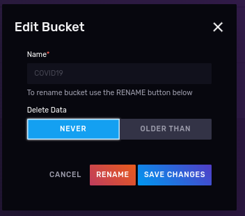
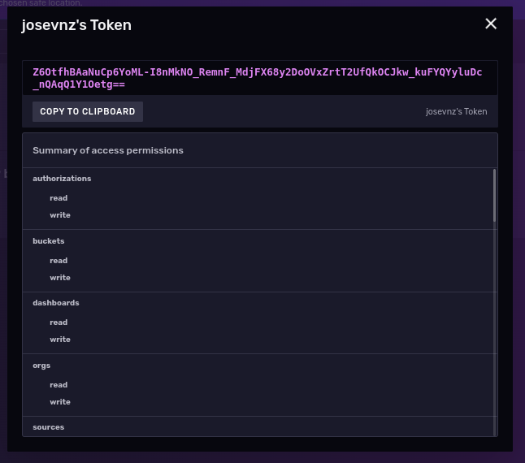
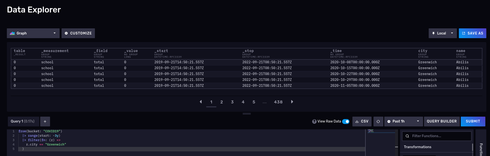
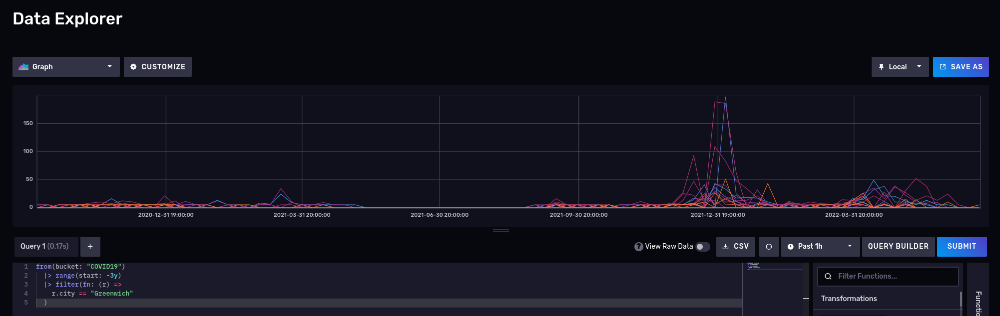
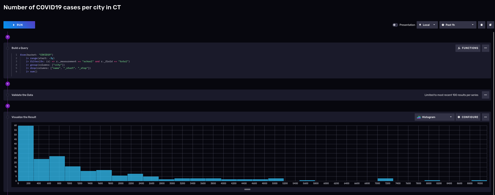
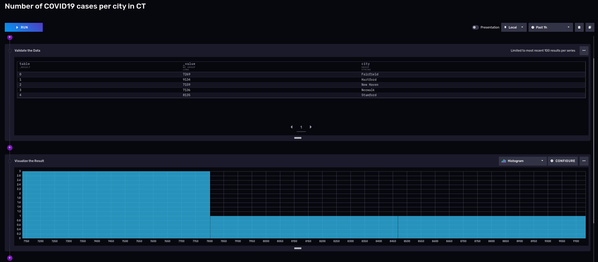
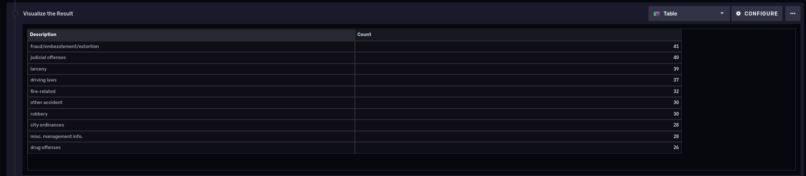
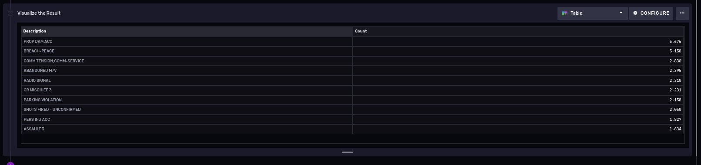
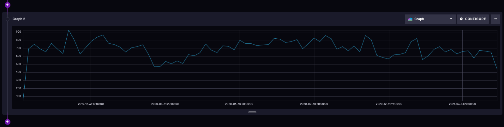
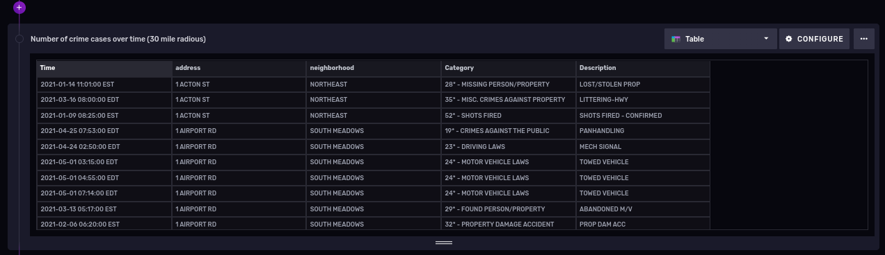

# Analyzing time series data with Python and Influxdb, using public domain datasets

This article is a [follow-up on my first article](https://github.com/josevnz/influxdb_intro/tree/main/tutorial) about Influxdb; There is some overlap as I assume not all readers are fully familiar with Influxdb, however I do want to show you more examples of what you can do with the tool.

# Running an Influxdb server from a container

This is maybe the easiest way to get you started; We will use an external volume to persist the data across container reboots and upgrades (please check the container page to see [all the possible options](https://hub.docker.com/_/influxdb)):

```shell=
podman pull influxdb:latest
podman run --detach --volume /data/influxdb:/var/lib/influxdb --volumne /data:/data:rw  --name influxdb_raspberrypi --restart always --publish 8086:8086 influxdb:latest
podman logs --follow influxdb_raspberrypi
```

Also, we are mapping an additional volume called /data directory inside the container, to import some CSV files later.

Next go to the machine where you are running influxdb (say http://localhost:8086) and [complete the installation steps](https://docs.influxdata.com/influxdb/v2.4/install/) by:
1. Creating a new user.
2. Creating a bucket, with no expiration where we will put our data. Call it 'COVID19' (case sensitive)

3. Creating a read/write API token for that works only on the covid19 bucket


# Working with data sets

On this tutorial I will use publicly available data from the [Connection Data Portal](https://data.ct.gov/).

## Covid 19 on schools

The state of Connecticut provides numbers for the School COVID cases through 2020-2022 in multiple formats, among other very useful information about the pandemic; For this tutorial, we will narrow our data exploration to 2 sets:

* [COVID-19-Cases-in-CT-Schools-By-School-2020-2021](https://data.ct.gov/Health-and-Human-Services/COVID-19-Cases-in-CT-Schools-By-School-2020-2021-S/u8jq-fxc2)
* [COVID-19-Cases-in-CT-Schools-By-School-2021-2022](https://data.ct.gov/Health-and-Human-Services/COVID-19-Cases-in-CT-Schools-By-School-2021-2022-S/8xd9-2eym)

### Importing data using an annotated CSV

We will use CSV data, so it makes sense to get familiar how we can [write it](https://docs.influxdata.com/influxdb/v2.4/write-data/) into the database the quickest and easiest way possible, so we can focus on analysis.

### What do you want from this dataset?

_Ask questions about your data first before coding_; In our case we want to see how many cases happened over a period of time for a given school or city.

Then you can decide to write queries, what data to discard, what to store.

Let's take a closer look at the data that from these files:

| District             | 	School ID | 	School name         | 	City  | 	School total | 	Report period           | 	Date updated |
|----------------------|------------|----------------------|--------|---------------|--------------------------|---------------|
| XXXX School District | 	1402	     | XXXX YYYYYYYY School | 	XXXX  | 	0	           | 10/08/2020 - 10/14/2020  | 	06/23/2021   |
| XXXX School District | 	1402	     | XXXX YYYYYYYY School | 	XXXX  | 	0	           | 10/15/2020 - 10/21/2020  | 	06/23/2021   |
| XXXX School District | 	1402	     | XXXX YYYYYYYY School | 	XXXX  | 	0	           | 10/22/2020 - 10/28/2020  | 	06/23/2021   |
| XXXX School District | 	1402	     | XXXX YYYYYYYY School | 	XXXX	 | 0	            | 10/29/2020 - 11/04/2020  | 	06/23/2021   |
| XXXX School District | 	1402	     | XXXX YYYYYYYY School | 	XXXX  | 	0            | 	11/05/2020 - 11/11/2020 | 	06/23/2021   |
| XXXX School District | 	1402	     | XXXX YYYYYYYY School | 	XXXX  | 	0            | 	11/12/2020 - 11/18/2020 | 	06/23/2021   |
| XXXX School District | 	1402	     | XXXX YYYYYYYY School | 	XXXX  | 	<6           | 	11/19/2020 - 11/25/2020 | 	06/23/2021   |

[Normalizing](https://www.datascienceacademy.io/blog/what-is-data-normalization-why-it-is-so-necessary/) your data will be always an priority, let's see a few issues that show up on the very first lines:

* The report period: We could explode this measurement for the time period, but instead will select the first date of the selected range. This means we will see updates for each town, every 7 days.
* The school total in some cases has indicators like <6; It is vague, so we will assume the upper limit (for example 5).
* Our interest is on the 'School name', 'City' and 'Report period'; In the case of Influxdb that constitutes a 'data point' and once you define it cannot be changed.* 

Then comes the decision on were and how to store the data; Influxdb has the concept of _tags and fields and measurements_ on, explained on [understanding-Influxdb-basics](https://www.influxdata.com/resources/understanding-Influxdb-basics/):

* A _bucket_ is nothing else but the database where the data will be stored; We will call ours 'covid19'
* Influxdb stores data into _measurements_ (Equivalent of a table on relational databases); Ours will be 'schools'.
* _Tags_: they are a combination of keys and values, they are used on indexes and their values do not change over time; think about them as metadata. In our case, the 'School name', 'City' are tags.
* _Fields_: They change over time, they are not indexed. The school total is a counter that will change over time.
* And finally the _time_: It is the fabric of our data, we will be derived from the 'Report period' and not from the date 'updated fields'

### Annotating the CSV

Influxdb needs help to figure out what it's important for you, what needs to he indexed (to speed up search, group queries), what columns could be ignored and where to put the data.

How does the [CSV annotation](https://docs.influxdata.com/influxdb/v2.4/write-data/developer-tools/csv/#csv-annotations) looks like? I found it easier to understand with an example that describes our data:

```text
District,School ID,School name,City,School total,Report period,Date updated
XXXX School District,1402,XXXX YYYYYYYY School,XXXX,<6,10/08/2020 - 10/14/2020,06/23/2021
```

Break it down by column:

* Ignored columns: District, School ID, Date Updated. I will not skip the columns on the massaged file but rather tell the ```influx write``` to ignore them, as I want to show you how.
* Tags: School name, City
* Fields: School total,
* Timestamp: Report period: Needs to be expanded and also date will be converted to [RFC3339](https://www.rfc-editor.org/rfc/rfc3339) (for example 1985-04-12T23:20:50.52Z); Dates also exploded for the period.

```text
# datatype measurement,ignored,tag,tag,long,time,ignored
school,district,name,city,total,time,updated
"school","XXXX School District","XXXX YYYYYYYY School","XXXX",0,"2020-10-08T00:00:00Z","06/23/2021"
"school","XXXX School District","XXXX YYYYYYYY School","XXXX",0,"2020-10-15T00:00:00Z","06/23/2021"
"school","XXXX School District","XXXX YYYYYYYY School","XXXX",0,"2020-10-22T00:00:00Z","06/23/2021"
"school","XXXX School District","XXXX YYYYYYYY School","XXXX",0,"2020-10-29T00:00:00Z","06/23/2021"
...
```

We do have also 2 files, so with a little help of a [Python script](../scripts/massage_school_covid_data.py) we will massage the data:

```python
#!/usr/bin/env python3
"""
This script massages CT COVID19 cases by school adding annotations for Influxdb, so they can be imported using the CLI.
"""
import csv
import datetime
import re
import sys
from argparse import ArgumentParser
from enum import Enum
from pathlib import Path

DEFAULT_REPORT = Path.home().joinpath("import_covid_data.csv")
MAX_ERRORS = 10

if __name__ == "__main__":
    PARSER = ArgumentParser("Convert CT school COVID19 data info an annotated CSV format for Influxdb")
    PARSER.add_argument('--destination', type=Path, default=DEFAULT_REPORT, help=f"Destination for massaged data. Default={DEFAULT_REPORT}")
    PARSER.add_argument('--explode', action='store_true',
                        help=f"Destination for massaged data. Default={DEFAULT_REPORT}")
    PARSER.add_argument('--max_errors', default=MAX_ERRORS, help=f"Maximum number of import errors, default {MAX_ERRORS}")
    PARSER.add_argument('source', nargs='+')
    ARGS = PARSER.parse_args()
    with open(ARGS.destination, 'w') as report:
        """
        Data normalization is a must; You can see than the format changed between 2020-2021 and 2021-2022:
        
        2020-2021: District,School ID,School name,City,School total,Report period,Date updated
        2021-2022: District,School Name,City,Report Period,Total Cases,Academic Year,Date Updated
        
        Also, order of total cases per school and report period flipped between years.
        
        To simplify things a little bit, we will drop a few columns from the resulting report
        2020-2021: School ID
        2021-2022: Academic Year
        
        Ending report will be:
        District,School Name,City,Total Cases,Report Period,Date Updated
        
        """
        report.write('''#datatype measurement,ignored,tag,tag,long,time,ignored
school,district,name,city,total,time,updated\n''')
        writer = csv.writer(report, delimiter=',', quotechar='"', quoting=csv.QUOTE_NONNUMERIC)
        num_errors = 0
        for data_file in ARGS.source:
            with open(data_file, 'r') as data:
                school_reader = csv.reader(data, delimiter=',')
                """
                Data format changed between year 2021-2022. Use the headers
                2020-2021: District,School ID,School name,City,School total,Report period,Date updated
                2021-2022: District,School Name,City,Report Period,Total Cases,Academic Year,Date Updated
                """
                original_format = True
                for row in school_reader:
                    try:
                        if row[0] == 'District':
                            original_format = row[1] == "School ID"
                            continue
                        if original_format:
                            class Position(Enum):
                                DISTRICT = 0
                                SCHOOL = 2
                                CITY = 3
                                TOTAL = 4
                                PERIOD = 5
                                UPDATED = 6
                        else:
                            class Position(Enum):
                                DISTRICT = 0
                                SCHOOL = 1
                                CITY = 2
                                TOTAL = 4
                                PERIOD = 3
                                UPDATED = 6
                        # Check for schools with less < 'cases' and take the upper limit (cases - 1)
                        matcher = re.search('<(\\d+)', row[Position.TOTAL.value])
                        if matcher:
                            total = int(matcher.group(1)) - 1
                        else:
                            total = int(row[Position.TOTAL.value])
                        date_ranges = row[Position.PERIOD.value].strip().split('-')
                        # Date in RFC3339
                        start = datetime.datetime.strptime(date_ranges[0].strip(), '%m/%d/%Y')
                        district = row[Position.DISTRICT.value]
                        school_name = row[Position.SCHOOL.value]
                        updated = row[Position.UPDATED.value]
                        city = row[Position.CITY.value]
                        if not ARGS.explode:
                            writer.writerow(
                                ["school", district, school_name, city, total, start.isoformat('T') + 'Z', updated])
                        else:
                            end = datetime.datetime.strptime(date_ranges[1].strip(), '%m/%d/%Y')
                            # We use a date generator
                            date_generated = (start + datetime.timedelta(days=x) for x in range(0, (end - start).days + 1))
                            for date in date_generated:
                                writer.writerow(["school", district, school_name, city, total, date.isoformat('T') + 'Z', updated])
                    except ValueError:
                        print(f"Problem parsing line: {row}, {data_file}", file=sys.stderr)
                        num_errors += 1
                        if num_errors > ARGS.max_errors:
                            print(f"Too many errors ({num_errors}), cannot continue!")
                            raise
```

Then run the normalizer script:
```shell
scripts/massage_school_covid_data.py --destination data/COVID-19_Cases_in_CT_Schools_Annotated.csv data/COVID-19_Cases_in_CT_Schools__By_School___2020-2021_School_Year.csv
data/COVID-19_Cases_in_CT_Schools__By_School___2021-2022_School_Year.csv
```

Next we call the influxdb container with these arguments:
1. Mount the directory where the annotated file is as a volume
2. Tell influx write the location of the Influxdb server with ```--host``` flag
3. Optional: Run with the ```dryrun``` flag, to see first if the parsing is correct

And example run with podman looks like this on the machine where I have the data file (If you notice, I'm running on a disposable container, just to check the file syntax):
```shell
podman run --rm --tty --interactive --volume $HOME/Documents/InfluxDBIntro/data:/mnt:ro influxdb:latest influx write dryrun --org Kodegeek --format csv --bucket covid19 --file /mnt/COVID-19_Cases_in_CT_Schools_Annotated.csv
odegeek
school,city=XXXX,name=XXXX\ YYYYYYYY\ School total=0i 1602115200000000000
school,city=XXXX,name=XXXX\ YYYYYYYY\ School total=0i 1602720000000000000
school,city=XXXX,name=XXXX\ YYYYYYYY\ School total=0i 1603324800000000000
school,city=XXXX,name=XXXX\ YYYYYYYY\ School total=0i 1603929600000000000
...     
```

Now let's do the real import, using the API token we created during the instance setup.

```shell
token='Z6OtfhBAaNuCp6YoML-I8nMkNO_RemnF_MdjFX68y2DoOVxZrtT2UfQkOCJkw_kuFYQYyluDc_nQAqQ1Y1Oetg=='
podman exec --interactive --tty influxdb_raspberrypi  influx write  --org Kodegeek --format csv --bucket COVID19 --file /var/lib/influxdb2/COVID-19_Cases_in_CT_Schools_Annotated.csv --token $token
```

If the tool shows no messages you may assume there were no errors; I found it better to check exploring the data to see if there were any issues.

## Exploring the data using Flux query language

The easiest way is to get a view of the raw data with a small filter, [using the Flux language](https://docs.influxdata.com/influxdb/v2.4/query-data/flux/):

We know what we have a bucket called 'COVID19' (we can see all the buckets with the ```buckets()``` function), for example what measurements we have on the COVID19 bucket we can do this (please note the import at the beginning of the FLUX query):

```text
import "influxdata/influxdb/schema"
schema.measurements(bucket: "COVID19")
```

Returns 'school', no surprises here. Now let's see what fields we have on that measurement

Let's try another one, number of cases for the schools on Greenwich for the 2020-2022 period:

```text
from(bucket: "COVID19")
  |> range(start: -3y)
  |> filter(fn: (r) => r.city == "Greenwich")
  |> yield()
```



What about a nice time series? Disable the raw mode and also switch to 'Graph':



Please note than Influxdb supports also [Influxql](https://docs.influxdata.com/influxdb/v2.4/query-data/influxql/); It is more like a SQL like language but from the documentation I got the impression than the company really wants you to use flux instead; also some features in [flux are not supported in influxql](https://docs.influxdata.com/influxdb/cloud/reference/syntax/flux/flux-vs-influxql).

#### More interesting queries

##### Number of COVID cases, by city

Cities with the highest number of cases

```text
from(bucket: "COVID19")
    |> range(start: -3y)
    |> filter(fn: (r) => r._measurement == "school" and r._field == "total")
    |> group(columns: ["city"])
    |> drop(columns: ["name", "_start", "_stop"])
    |> sum()
```

And we can visualize it using a notebook:



Most of the cities had around 200 cases, but keep in mind than these cities are small.

Flux is a functional language, and you can keep piping the results to other filters, transformations; Say for sake of example you now only want to see towns that had more than 7000 cases on the last 3 years:


```python
from(bucket: "COVID19")
    |> range(start: -3y)
    |> filter(fn: (r) => r._measurement == "school" and r._field == "total")
    |> group(columns: ["city"])
    |> drop(columns: ["name", "_start", "_stop"])
    |> sum()
    |> filter(fn: (r) => r._value >= 7000)
```



3 towns up to 7,800 cases, the rest left to Stamford with 8135 and Hartford with 9,134 cases.

Interesting thing about this distribution:

* Single peak
* Right-skewed
* It looks like is slightly [Platykurtic](https://www.investopedia.com/terms/p/platykurtic.asp) 

Let's move on with a more complex dataset to see what else we can do with a time series and this tool.

## Another dataset: Hartford Police Incidents from 01/01/2005 to 05/18/2021

But first, let's learn about the city of Hartford:

> Hartford is the capital and the fourth-largest city of Connecticut, an important industrial and commercial center of the country as well as the core city in the Greater Hartford metropolitan area, situated in the Connecticut River Valley. The city located in the north-central part of the state is settled on October 15, 1635, and named on February 21, 1637. It is a large financial center of the area which has got the fame of the "insurance capital of the country". It is considered the city's economy is very strong, just like one of San Francisco and other leading economic hubs of the US. The city has been also home to several notable people such as famous authors Mark Twain and Harriet Beecher Stowe.

Their police department collected information about crimes and made it public available on the [Hartford data website](https://data.hartford.gov/):

> In May 2021 the City of Hartford Police Department updated their Computer Aided Dispatch(CAD) system. [This historic dataset reflects](https://data.hartford.gov/Public-Safety/Police-Incidents-01012005-to-05182021/889t-nwfu) reported incidents of crime (with the exception of sexual assaults, which are excluded by statute) that occurred in the City of Hartford from January 1, 2005 to May 18, 2021

What is inside [this dataset](https://data.hartford.gov/api/views/889t-nwfu/rows.csv?accessType=DOWNLOAD&bom=true&format=true)? 

* 709K rows
* 12 columns:

| Description       | Type        | Column # |
|-------------------|-------------|----------|
| Case_Number       | Number      | 1        |
| Date              | Date & Time | 2        |
| Time_24HR         | Plain Text  | 3        |
| Address           | Plain Text  | 4        |
| UCR_1_Category    | Plain Text  | 5        |
| UCR_1_Description | Plain Text  | 6        |
| UCR_1_Code        | Number      | 7        |
| UCR_2_Category    | Plain Text  | 8        |
| UCR_2_Description | Plain Text  | 9        |
| UCR_2_Code        | Number      | 10       |
| Neighborhood      | Plain Text  | 11       |
| geom              | Location    | 12       |

Grab a copy of the data for offline processing:

```shell
curl --fail --location --output 'police-incidents-hartford-ct.csv' 'https://data.hartford.gov/api/views/889t-nwfu/rows.csv?accessType=DOWNLOAD&bom=true&format=true'
```

What is inside?:

```text
Case_Number,Date,Time_24HR,Address,UCR_1_Category,UCR_1_Description,UCR_1_Code,UCR_2_Category,UCR_2_Description,UCR_2_Code,Neighborhood,geom
21013791,05/10/2021,1641,123 XXX ST,32* - PROPERTY DAMAGE ACCIDENT,PROP DAM ACC,3221,,,0,CLAY-ARSENAL,"(41.780238042803745, -72.68497435174203)"
21014071,05/13/2021,0245,111 YYY ST,32* - PROPERTY DAMAGE ACCIDENT,PROP DAM ACC,3261,24* - MOTOR VEHICLE LAWS,EVADING RESP,2401,BEHIND THE ROCKS,"(41.74625648731947, -72.70484012171347)"
20036741,11/29/2020,1703,23456 ZZZ ST,31* - PERSONAL INJURY ACCIDENT,PERS INJ ACC,3124,23* - DRIVING LAWS,FOLL TOO CLOSE,2334,BEHIND THE ROCKS,"(41.74850755091766, -72.69411393999614)"
21013679,05/09/2021,2245,ZZZ AV & QQQQ ST,345* - PERSONAL INJURY ACCIDENT,PERS INJ ACC,3124,23* - DRIVING LAWS,TRAVELING TOO FAST,2327,UPPER ALBANY,"(41.778689832211015, -72.69776621329845)"
```

Just at first sight we can see _it is not sorted_, date and dates/ times are in non-standard format, but otherwise it seems easy to normalize.

To complicate things a little more, the Uniform Crime Reporting ([UCR)](https://ucr.fbi.gov/nibrs/2011/resources/nibrs-offense-codes)) codes have a separate document that [explains their meaning](https://data.hartford.gov/api/views/889t-nwfu/files/BOGvjBIm4--AIkVZZIBXBljNj-PrylsI5BxLEEQ4Lms?download=true&filename=Socrata%20HPD%20UCR%20Codes.pdf).

```text
ucr_code,primary_description,secondary_description
0100,homicide,homicide-crim
0101,homicide,murder-handgun
```

We will put all these measurements on different buckets with an expiration of _never_ (normally your dataset points have an expiration date); for these 2 datasets we need to do some data manipulation, so instead of writing a massaging-only script we will write a couple if importers using [the Python SDK](https://github.com/influxdata/influxdb-client-python) for maximum flexibility. 

First [import](../scripts/socrata_codes_importer.py) the Socrata UCR codes using a script:

[](https://asciinema.org/a/527215)

And then import the police incidents using a different and slightly more complex script ([police_case_importer.py](../scripts/police_cases_importer.py):

[](https://asciinema.org/a/528791)

The [police_cases_importer.py](../scripts/police_cases_importer.py) also adds the ability to work with geolocation data inside Influxdb. The code fragment that handles the insertion of a data point using the [Python API write client](https://influxdb-client.readthedocs.io/en/stable/api.html#writeapi) is shown below:

```python
                            s2_cell_id_token = s2cell.lat_lon_to_token(lat, lon)
                            police_incident = Point(measurement) \
                                .field("case_Number", case_number) \
                                .tag("address", address) \
                                .tag("ucr_1_category", ucr_1_category) \
                                .tag("ucr_1_description", ucr_1_description) \
                                .field("ucr_1_code", ucr_1_code) \
                                .tag("ucr_2_category", ucr_2_category) \
                                .tag("ucr_2_description", ucr_2_description) \
                                .field("ucr_2_code", ucr_2_code) \
                                .tag("neighborhood", neighborhood) \
                                .tag("s2_cell_id", s2_cell_id_token) \
                                .field("lat", lat) \
                                .field("lon", lon) \
                                .time(date_time.utcnow(), WritePrecision.S)
                            write_api.write(bucket, org, police_incident)
```

### Not so fast: What if the data is not sorted by time

The Hartford police department data is not strictly sorted by time but by case number; [this will definitely affect performance](https://docs.influxdata.com/influxdb/v2.4/reference/key-concepts/design-principles/).

I found that many of my queries a very long time to come back because the data was not properly sorted to begin with; This dataset is not terribly big (~ 112MB) so I made another change on the importer to sort the parsed collection in memory before inserting.

_This sorting approach will not work for Gigabyte or Terabyte datasets_, so an external sorting and more data normalization may be required.

## What we can learn from these police incidents public data

### How many types of types crimes exist for each primary crime type code?

```text
from(bucket: "SocrateCodes") |> range(start: v.timeRangeStart, stop: v.timeRangeStop)
  |> filter(fn: (r) => r["_measurement"] == "socrata_ucr_codes")
  |> filter(fn: (r) => r._field == "ucr_code")
  |> group(columns: ["primary_description"])
  |> count(column: "_value")
  |> group(columns: ["_value", "primary_description"], mode: "except")
  |> sort(columns: ["_value"], desc: true)
  |> limit(n: 10)
```

So we see the count per primary description; Also noted that we keep piped the output of the previous group query into another one, so we fit all the results into a single table:



### 10 most common types of polices cases in the last 3 years

Let's do something similar but to find out the 10 most common types of police cases in the last 3 years:

```text
from(bucket: "PoliceCases")
    |> range(start: -3y)
    |> filter(fn: (r) => r._measurement == "policeincidents" and r._field == "ucr_1_code")
    |> group(columns: ["ucr_1_description"])
    |> drop(columns: ["neighborhood", "s2_cell_id", "lon", "lat", "ucr_2_category", "ucr_2_description", "ucr_2_code", "address"])
    |> count(column: "_value")
    |> group()
    |> sort(columns: ["_value"], desc: true)
    |> limit(n: 10)
```

NOTE: It turns out this query takes a long time to run on my tiny Raspberry PI 4 server for anything longer than 4 years; 
[there is a known issue on the UI](https://github.com/influxdata/influxdb/issues/17142) that terminates your session too soon, so I ended writing a [Python client instead](../scripts/most_common_crime_types.py) for this query:



### Number of cases over time, grouped by week

We only need to [truncate the precision](https://docs.influxdata.com/flux/v0.x/data-types/basic/time/#truncate-timestamps-to-a-specified-unit) of our '_time' column to get a time series of the number of cases over time for a period of time, that will 'group' the results into buckets for us.

```text
from(bucket: "PoliceCases")
    |> range(start: -3y)
    |> filter(fn: (r) => r._measurement == "policeincidents" and r._field == "case_number")
    |> truncateTimeColumn(unit: 1w)
    |> group(columns: ["case_number", "_time"])
    |> count()
    |> group()
```

And here is the result:



You could add the _ucr_1_code_ number to be more specific about a certain type of crimes, on the filter section of our flux query.

### Playing with geolocation data

At the time of this writing (influx 2.4.0) this something that is _labeled as experimental on Influxdb_; native support of geolocation capabilities inside the database [is a very useful feature](https://docs.influxdata.com/influxdb/cloud/query-data/flux/geo/), let's explore it next.

If you want to take a quick taste of the geolocation capabilities, you could run the following on a notebook:

```text
import "influxdata/influxdb/sample"
import "experimental/geo"
sampleGeoData = sample.data(set: "birdMigration")
sampleGeoData
    |> geo.filterRows(region: {lat: 30.04, lon: 31.23, radius: 200.0}, strict: true)
```

Coming back to our police cases dataset,  can we find out the number of crimes for the year 2021, withing a radio of 30 miles on Hartford, CT?

First, a bit of geography:

> Hartford, CT, USA Latitude and longitude [coordinates are: 41.763710, -72.685097](https://www.latlong.net/place/hartford-ct-usa-2637.html).

First let's get a table with some data

```text
from(bucket: "PoliceCases")
    |> range(start: 2021-01-01T00:00:00.000Z, stop: 2021-12-31T00:00:00.000Z)
    |> filter(fn: (r) => r._measurement == "policeincidents" and r._field == "lat" or r.field == "lon")  
    |> group()
```

And now filter cases within 30 miles (48.28032 Kilometers) radio from our Hartford coordinates:

```text
import "experimental/geo"
from(bucket: "PoliceCases")
    |> range(start: 2021-01-01T00:00:00.000Z, stop: 2021-12-31T00:00:00.000Z)
    |> filter(fn: (r) => r._measurement == "policeincidents" and r._field == "lat" or r.field == "lon")
    |> geo.filterRows(region: {lat: 41.763710, lon: -72.685097, radius: 48.28032}, strict: false)  
    |> group()
```



Let's cover one more topic in detail before finishing.

# Getting that data our of Influxdb using Python API

Influxdb has a really nice feature that generates code client from the UI. For our previous example, in Python:

```python
from influxdb_client import InfluxDBClient

# You can generate a Token from the "Tokens Tab" in the UI
token = "<INFLUX_TOKEN>"
org = "Kodegeek"
bucket = "COVID19"

with InfluxDBClient(url="http://raspberrypi:8086", token=token, org=org) as client:
    query = """from(bucket: "COVID19")
    |> range(start: -3y)
    |> filter(fn: (r) => r._measurement == "school" and r._field == "total")
    |> group(columns: ["city"])
    |> drop(columns: ["name", "_start", "_stop"])
    |> sum()
    |> filter(fn: (r) => r._value >= 7000)
    |> sort(columns: ["_value"])"""
    tables = client.query_api().query(query, org=org)
    for table in tables:
        for record in table.records:
            print(record)
```

Am example run may look like this:

```shell 
FluxRecord() table: 0, {'result': '_result', 'table': 0, 'city': 'Fairfield', '_value': 7269}
FluxRecord() table: 1, {'result': '_result', 'table': 1, 'city': 'Hartford', '_value': 9134}
FluxRecord() table: 2, {'result': '_result', 'table': 2, 'city': 'New Haven', '_value': 7159}
FluxRecord() table: 3, {'result': '_result', 'table': 3, 'city': 'Norwalk', '_value': 7136}
FluxRecord() table: 4, {'result': '_result', 'table': 4, 'city': 'Stamford', '_value': 8135}
```

That looks rough, instead let me [show you a more polished version](../scripts/cases_per_town.py):

[](https://asciinema.org/a/526876)

# Wrapping up

Of course there is much more you can do with this tool, here are some ideas:

* The [Connecticut OpenData portal](https://data.ct.gov/) has lots more interesting data sets you can download for free and learn about the state; I bet you have similar portals with public data where you live.
* If you write scripts in Python, you should definitely take a look at the [examples from the Git repository](https://github.com/influxdata/influxdb-client-python).


